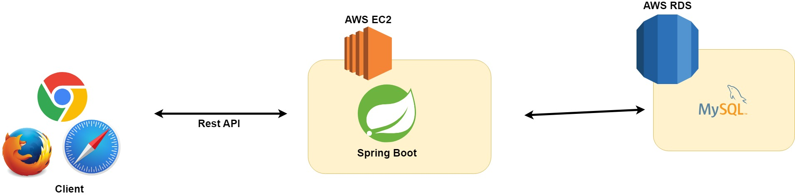

# K Store

- 간단한 중고장터 개발 프로젝트

# 목차
- [사용 기술](#사용-기술)
- [요구사항](#요구사항)
- [ER 다이어그램](#ER-다이어그램)
- [API 문서](#api-문서)

## 사용 기술

### 프론트엔드

- Html/Css
- Javascript, JQuery
- Thymeleaf

### 백엔드

- Java 11
- SpringBoot 2.7
- Spring Data JPA 
- Spring Security 5.7
- Spring Rest Docs
- QueryDsl

### 데이터베이스

- h2 (로컬 환경)
- Mysql (리눅스 환경)

### build tool

- gradle

### 버전 관리

- git, github

## 요구사항

- 로그인, 회원가입
- 회원이 판매하고자하는 물품을 사진과 함께 올릴 수 있다.
- 게시물의 생성, 읽기, 수정, 삭제
- 댓글의 생성, 읽기, 수정, 삭제
- 게시물 검색
- 거래 신청,수락,완료 등의 상태관리
- 관리자가 회원의 게시글,댓글을 관리할 수 있다. (미구현)
- 관리자가 회원 탈퇴처리 (미구현)
- url 기반의 db연동 인가처리 (미구현)

## 아키텍처

## ER 다이어그램

## 거래 플로우 차트

## API 문서

- API 문서는 Spring Rest Docs를 사용하여 문서를 작성하였습니다.

<a href="https://htmlpreview.github.io/?https://github.com/k-mini/Store/blob/dev/src/main/resources/static/docs/user.html" target="_blank">유저 API</a>  
<a href="https://htmlpreview.github.io/?https://github.com/k-mini/Store/blob/dev/src/main/resources/static/docs/itemboard.html" target="_blank">거래 게시판 API</a>  
<a href="https://htmlpreview.github.io/?https://github.com/k-mini/Store/blob/dev/src/main/resources/static/docs/trade.html" target="_blank">거래 API</a>  
<a href="https://htmlpreview.github.io/?https://github.com/k-mini/Store/blob/dev/src/main/resources/static/docs/comment.html" target="_blank">댓글 API</a>
