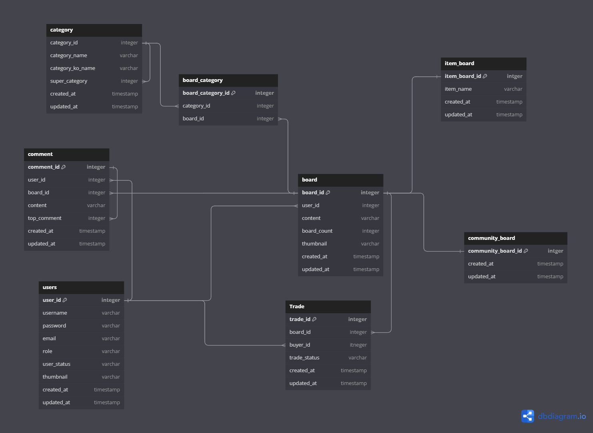

# K Store

- 간단한 중고장터 개발 프로젝트

# 목차
- [사용 기술](#사용-기술)
- [요구사항](#요구사항)
- [ER 다이어그램](#ER-다이어그램)

## 사용 기술

### 프론트엔드

- Html/Css
- Javascript, JQuery
- Thymeleaf

### 백엔드

- Java 11
- SpringBoot 2.7
- Spring Data JPA 
- Spring Security 5.7
- QueryDsl

### 데이터베이스

- h2 (로컬 환경)
- Mysql (리눅스 환경)

### build tool

- gradle

### 버전 관리

- git, github

## 요구사항

- 로그인, 회원가입
- 회원이 판매하고자하는 물품을 사진과 함께 올릴 수 있다.
- 게시물,댓글의 생성,읽기,수정,삭제
- 관리자 계정이 따로 존재하며 해당 계정을 통해 회원의 게시글을 삭제할 수 있다.

## 현재가지 구현한 기능

- 스프링 시큐리티를 사용한 회원가입, 로그인
- 게시물 작성, 삭제, 수정
- 게시물 제목,내용으로 검색
- 게시물 댓글 작성, 삭제

## API 설계 요약

### 인증

### /auth/signup (GET)

> 회원가입 화면 표시

### /auth/signup (POST)

> 회원가입 과정 진행

### /auth/signin (GET)

> 로그인 화면 표시

### /auth/signin(POST)

> 로그인 처리

### 게시물

### /boards/{category}/{subCategory}?page={number}&order={key} (GET)

- category : 상위 카테고리, subCategory: 하위 카테고리
- number : 페이지 번호(0부터 시작), key=정렬 기준

>  해당 분류로 설정한 페이지 조회

### /boards/{category}}/{subCategory}/form  (GET)

- category : 상위 카테고리, subCategory: 하위 카테고리

> 게시판 작성 화면을 표시

### /boards/{category}/{subCategory}/form (POST)

> 게시판 작성

### /board/{category}/{subCategory}/{boardId} (GET)

- category : 상위 카테고리, subCategory: 하위 카테고리, boardId: 게시물 번호

> 해당 게시물 조회

### 댓글

### /api/comment (POST)

> 댓글 저장

### /api/comment/{commentId} (DELETE)

> 댓글 삭제

### /api/comment/{commentId}/reply (POST)

> 대댓글 저장

## ER 다이어그램

## 거래 플로우 차트

