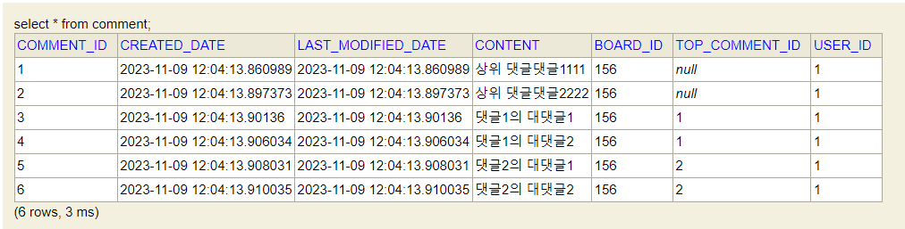
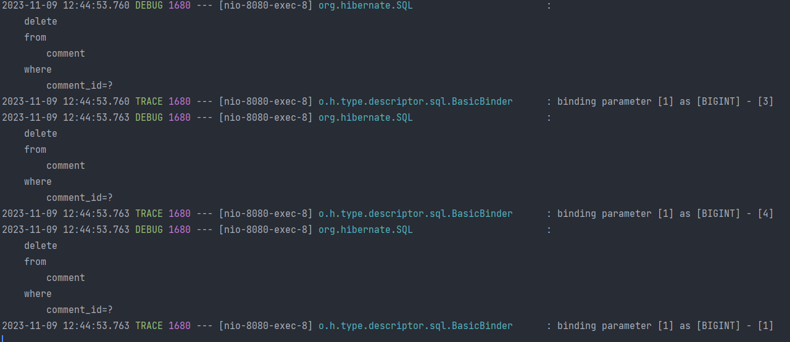
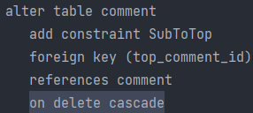

# 댓글 삭제 문제

## 현재 데이터

> 현재 데이터베이스에 해당 데이터가 들어있다고 가정하겠습니다.

## 불필요한 쿼리

> 대댓글이 있는 댓글을 삭제할 때 자식 댓글의 데이터까지 같이 삭제하려고 설계를 한 뒤, 
> 엔티티 연관관계 설정을 cascadeType.Removal 설정을 해주었습니다.
> 그러나, 스프링 Data Jpa가 제공하는 deleteById 메서드를 이용해 댓글 삭제시 불필요한 조회쿼리 및 삭제쿼리가 
> 엔티티별로 하나씩 나가는 것을 보고 나중에 성능상 문제점이 있을거라 판단하였습니다. 

- 대댓글 개수마다 쿼리가 나가는 낭비 발생.

## 방법 1 : @OnDelete

> 쿼리가 적게 나가면서 자식 댓글까지 한번에
> 삭제하는 방법을 찾던 중, 하이버네이트에서 @OnDelete 어노테이션을 지원하는 것을 확인했습니다.
> 해당 어노테이션을 붙이면 댓글 테이블에 외래키 제약 조건에 on delete cascade가 붙게되어
> 쿼리를 한번만 날려도 자식댓글까지 삭제가 다 진행되게 됩니다.

## 방법 2 : jpql 쿼리 2번 날리기

> 단순하게 자식 댓글을 삭제하는 쿼리와 부모 댓글을 삭제하는 쿼리를 분리하는 것입니다.
> 쿼리가 2번 나간다는 단점이 있지만, 쿼리가 상대적으로 단순하고 삭제된 행의 총 개수를
> 계산할 수 있습니다.

## 문제 및 결론

> 1번 방법을 사용하면 쿼리 실행결과를 자식 댓글이 포함된 총 개수가 아닌,
> 부모댓글만 삭제한 행의 갯수 1로 받게되어 응답시 변경된 행의 개수로 총 댓글 개수를
> 감소시켜야 하는 부분에서 문제가 생겼습니다.
> 
> 
> 또한 현재는 자식 댓글까지 삭제하는 걸로 기능을 구현했지만, 상용중인 홈페이지를 둘러보면 자식 댓글이 있으면 
> 가능한 사이트도 있고 삭제가 불가능한 경우도 있습니다. 
> 
> 2번 방법은 쿼리가 2개 나가긴 합니다. 다만, 댓글이 계속 달린다고
> 해서 댓글의 개수 증가에 따라 쿼리의 개수가 증가하는 것은 아닙니다. 제가 구현한 댓글은 무한 댓글이 아니기 때문에 무조건 2개입니다.
> 
> 따라서 향후 기능의 요구사항이 변경될 수 있다는 점을 고려해보면 제약조건(on delete cascade)을 추가하는 것보다 방법 2인 자식 댓글을 삭제하는
> 쿼리와 부모댓글을 삭제하는 쿼리 2번 보내는 것이 더 나은 선택이라 생각합니다. 
> 
> 
> 물론 이 방법도 상황에 따라 요구사항이 바뀌면 쿼리를 다시 수정해야 하지만, 테이블의 제약 조건을 변경하는
> 것보다는 쿼리를 수정하는 것이 유지보수적인 측면에서 비용이 더 적다고 생각합니다.
