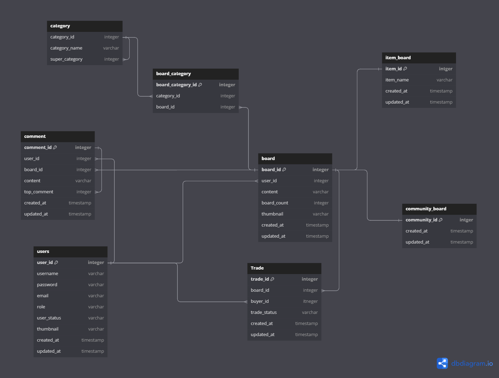
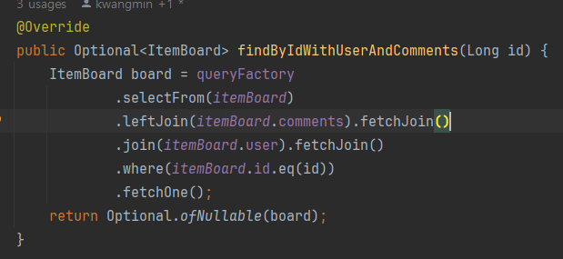
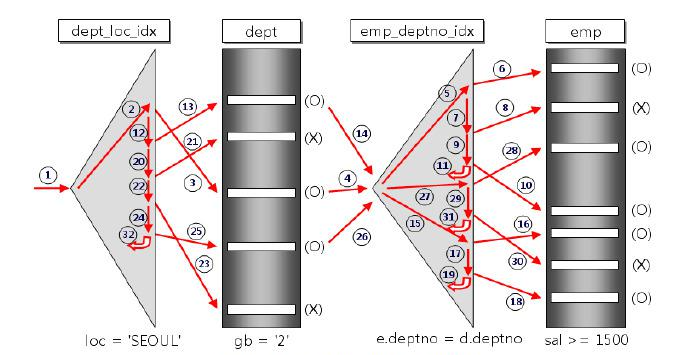
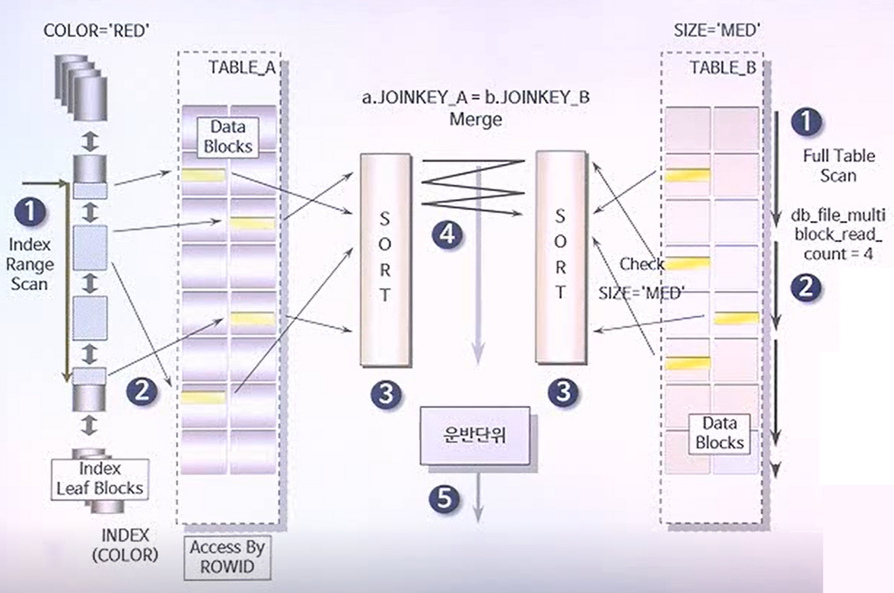
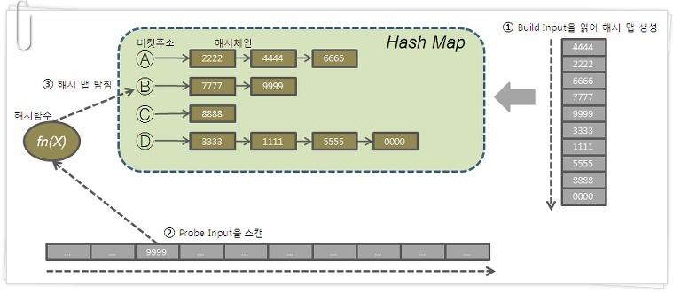

# 조인 vs 다중 쿼리 문제

## 상황

> 현재 제가 설계한 ERD 다이어그램입니다. 게시물은 유저와 거래를 다대다 관계를 이루고 있습니다.

 

> 다음은 유저가 올린 물건을 보는 상세 게시판을 구현하던 화면입니다.
> 저는 처음에 게시판을 구현할 당시 거래신청 버튼이 없었고, 해당 화면에 해당하는 데이터를 가져오는
> 쿼리를 작성할 때, 일단 다음과 같이 처음에 코드를 작성하였습니다.

> 단순하게 게시판, 댓글, 유저 이 3가지를 fetch join으로 가져와서 기능을 구현하고 있었는데,
> 거래 신청 버튼을 db에 저장되어 있는 해당 게시물에 대한 거래 상태 정보를 가져오는 기능까지
> 추가로 구현하다 보니 고민이 생겼습니다. 점점 프로젝트를 개발하다보면, 추가적인 엔티티가 계속 추가될 텐데, 
> 이렇게 계속 fetchjoin이나 join으로 엔티티와 관련된 모든 데이터를 가져와도 될까?
> 해당 게시물의 가장 최신의 거래 상태를 가져오기만 하면 되기 때문에,  
> select 절에 서브쿼리로 trade테이블의 상태정보만 조회해도 될 것 같았습니다. 하지만, 해당 기능을 사용하면 fetchjoin을 포기해야 하고 dto로 가져와야 합니다.
> 그러면 엔티티를 가져오지 조회하지 못해 흔히 말하는 객체지향적? 인 코드를 작성하지 못할것 같았습니다.
> dto로 가져오는 것과 엔티티로 가져오는 것의 장단점은 무엇일까?
> 서브쿼리를 작성해 추가적인 쿼리를 날리지 않고, 쿼리 한방에 가져오려고 하는 게 좋은 방법일까? 등등 많은 생각이 들었습니다.

## 조인을 쓸까? 다중쿼리를 쓸까?

> 저는 막연하게 쿼리를 많이 사용하면 db와의 네트워크 통신 비용이 상대적 크다고 어렴풋이 생각해서 쿼리를 적게 날리려고 했었습니다.

## JOIN 알고리즘

- NESTED LOOP JOIN (중첩 루프 조인)

- 이중 for문 처럼 접근하는 방식

- SORT_MERGE JOIN
- 양쪽 테이블을 각자 acess 및 정렬 후 merge

- HASH JOIN
- 해시 함수 이용

## 결론

- nested loop join 같은 알고리즘을 만약에 타게되면 곱연산으로 행의 개수가 늘어난다. 테이블 A 테이블 B의 행의 개수가
- 각각 30,50개면 30*50개의 행을 스캔. 하지만 인덱스가 있으면 이보다 적음
- 행과 행의 관계가 일대일 이나 다대일인 경우에는 행의 개수가 증가하지 않아서
- 성능에 문제가 발생하진 않을 것 같으나 결국 어떤 알고리즘을 쓸지는 옵티마이저에 의해 정해주기 때문에
- 쿼리를 짜보고 쿼리가 느리다 싶으면 실행계획이나 프로파일링등을 통해 쿼리를 개선해야 한다. 입니다.

## 용어 정리

- 드라이빙(driving) 테이블 : 조인을 수행할 때 먼저 접근하는 테이블
- 드리븐(driven) 테이블 : 드라이빙 테이블 이후에 검색하는 테이블

### 참고 

- https://velog.io/@clock509/MySQL-SQL-%ED%8A%9C%EB%8B%9D-%EC%9A%A9%EC%96%B43-%EC%A1%B0%EC%9D%B8-%EC%97%B0%EC%82%B0%EB%B0%A9%EC%8B%9D%EA%B3%BC-%EC%A1%B0%EC%9D%B8-%EC%95%8C%EA%B3%A0%EB%A6%AC%EC%A6%98
- https://tecoble.techcourse.co.kr/post/2023-10-09-join-query-vs-multiple-quries/
- https://stackoverflow.com/questions/1067016/join-queries-vs-multiple-queries
- https://needjarvis.tistory.com/162
- https://coding-factory.tistory.com/758