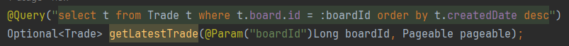
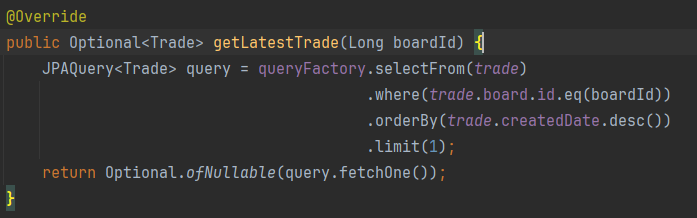

# jpql limit 키워드 지원 안하는 문제

## 상황

> 특정 게시물의 가장 최신 거래 상태를 확인해서 거래 가능 불가능 여부를 판단하기 위해서 쿼리를 짜야하는
> 상황이었습니다. 그러나 @Query 어노테이션에서 jpql쿼리를 작성했지만 컴파일 시점에서 계속 오류가 발생하였습니다.
> 로그를 확인하니 limit를 unexpected token으로 인식하는 문제였습니다. 구글링을 통해 확인해보니 jpql에서
> limit 키워드를 지원하지 않는 것이었습니다.. limit 키워드를 제거하고 리스트째로 가져와서 인덱스 0번을 조회해도
> 문제를 해결할 순 있으나, 불필요한 데이터가 이동하는 것을 최소화하기 위해 더 검색 및 생각을 해보니 선택지가 2개정도로
> 추려졌습니다.

### 방법 1 : pageable

> 스프링 데이터 JPA에서 지원하는 Pageable 인터페이스를 페이지 0, 사이즈 1로 하여 파라미터에 추가 하는 것입니다.
> 하지만 해당 방법은 메서드 시그니처에 Pageable 인터페이스가 추가 되고 리턴타입이 List, Page, Slice 로 한정됩니다.

### 방법 2 : querydsl 사용

> querydsl에서 지원하는 limit 메서드를 사용하기
> 해당 방법은 메소드 시그니처의 변화가 없고, 반환타입을 자유롭게 캐스팅해서 반환할 수 있습니다.

- Optional로도 반환이 가능

### 결론

> 2번 방법을 택했습니다. 메서드 시그니처가 상대적으로 단순하고
> querydsl은 리턴타입을 자유롭게 정할 수 있기 때문에 더 유연성이 높다고 판단했습니다.